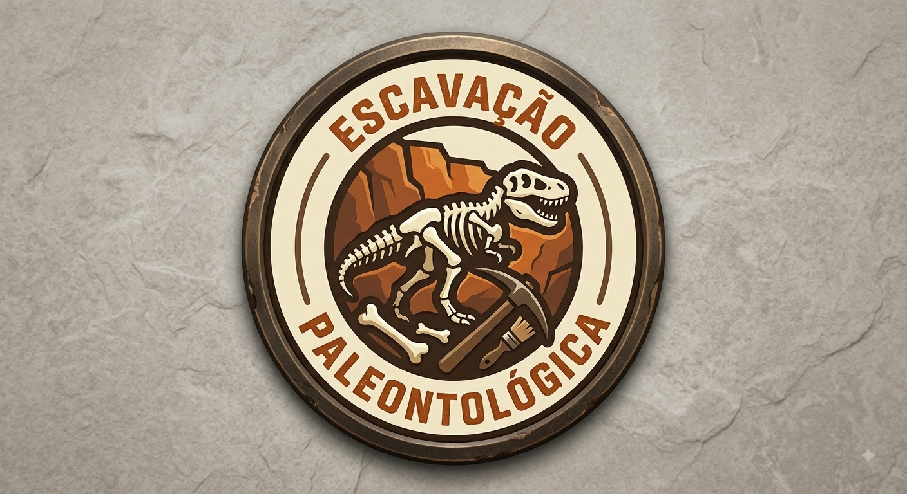
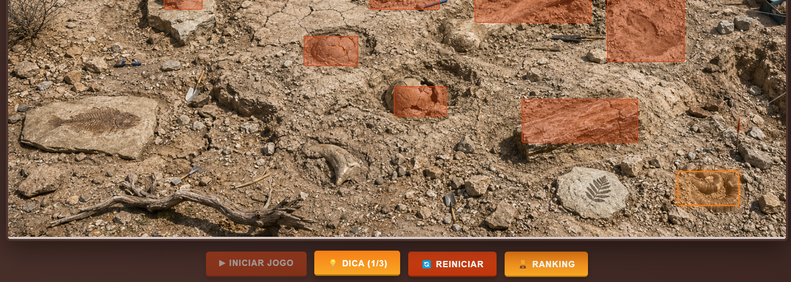
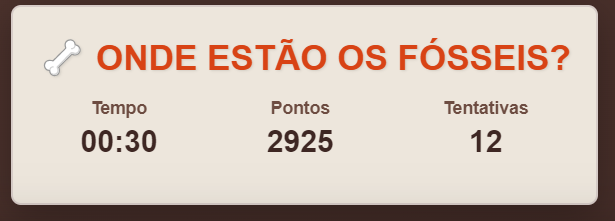
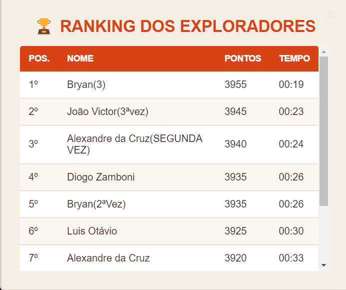

# 🦖 Jogo da Escavação Paleontológica



Esta aplicação foi desenvolvida no âmbito do **Programa de Educação Tutorial (PET)**, tomando como base o projeto original criado pelo desenvolvedor [PedroHPedroso](https://github.com/PedroHPedroso).

A partir do repositório base, foram realizadas reformulações visuais e estruturais para transformar a experiência em um **jogo interativo de "7 erros" com temática de Paleontologia**. Além disso, aplicaram-se ajustes na lógica do sistema com a integração do **Electron**, garantindo o funcionamento otimizado como aplicação desktop para o cenário proposto.

O projeto foi apresentado e utilizado ativamente no totem interativo do evento **"Quintas das Ciências"**, atendendo a estudantes do Ensino Fundamental I, II e Ensino Médio, obtendo um feedback extremamente positivo do público.

---

## 🛠️ Tecnologias e Ferramentas


---

## 🏗️ Arquitetura do Projeto e Funcionamento

A aplicação segue uma **separação clara de responsabilidades**, organizada em duas pastas principais na raiz do repositório:

| Pasta | Função |
|---|---|
| `src/` | Contém todo o **código-fonte** da aplicação: a lógica do jogo (`script.js`), a interface visual (`index.html` e `style.css`) e os arquivos de integração com o Electron (`main.js` e `preload.js`). |
| `public/` | Armazena todos os **assets e imagens estáticas** utilizados pelo jogo, como a imagem principal da cena de escavação (`escavacao.png`) e demais recursos visuais. |

Essa divisão garante que a camada de **apresentação e lógica** fique desacoplada dos **recursos estáticos**, facilitando a manutenção e eventuais substituições de assets sem impacto no código.

```
Bio-Game-main/
├── public/
│   └── escavacao.png          # Assets e imagens estáticas do jogo
├── src/
│   ├── index.html             # Estrutura da interface (HTML)
│   ├── style.css              # Estilização visual (CSS)
│   ├── script.js              # Lógica e mecânicas do jogo (JS)
│   ├── main.js                # Processo Principal do Electron
│   └── preload.js             # Ponte segura (contextBridge)
├── package.json
└── README.md
```

### 🎮 Demonstração do Jogo

> As imagens abaixo ilustram a interface do jogo e os assets visuais utilizados na experiência interativa do totem.






---

## ⚡ Integração com a API do Electron

O Electron opera sob um **modelo de dois processos** distintos que se comunicam de forma controlada e segura:

```
┌─────────────────────────────┐       IPC Channel       ┌─────────────────────────────┐
│    PROCESSO PRINCIPAL        │ ◄──────────────────────► │   PROCESSO DE RENDERIZAÇÃO  │
│       (main.js)              │                          │  (index.html + script.js)   │
│                              │                          │                             │
│  • Gerencia a janela (kiosk) │     [ preload.js ]       │  • Exibe a interface do     │
│  • Controla o ciclo de vida  │   contextBridge API      │    jogo ao jogador          │
│  • Grava resultados em CSV   │ ◄──────────────────────► │  • Captura interações e     │
│  • Registra atalhos globais  │                          │    envia eventos via IPC    │
└─────────────────────────────┘                          └─────────────────────────────┘
```

### `main.js` — Processo Principal

O arquivo `main.js` é o **ponto de entrada** da aplicação Electron e centraliza todo o gerenciamento de infraestrutura:

- **Criação da janela em modo kiosk** (`fullscreen: true`, `kiosk: true`, `frame: false`), ideal para o uso em totens interativos, impedindo que o usuário navegue para fora da aplicação;
- **Controle do ciclo de vida** do app via `app.whenReady()`, `app.on('window-all-closed')` e `app.on('activate')`;
- **Registro de atalhos globais** (`globalShortcut`) para administradores — por exemplo, `Ctrl+Shift+Q` fecha o kiosk de forma controlada;
- **Escuta de eventos IPC** (`ipcMain.on`) para receber dados do Processo de Renderização:
  - `save-player` — recebe o cadastro do jogador ao iniciar a partida;
  - `save-game-result` — recebe o resultado completo ao final da partida e **grava os dados em um arquivo `.csv`** no diretório de dados do usuário (`app.getPath('userData')`), registrando: Nome, Idade, Escola, Etapa, Data/Hora, Pontuação e Tempo.

### `preload.js` — Ponte Segura via `contextBridge`

O `preload.js` atua como **camada de segurança** entre os dois processos. Com `contextIsolation: true` e `nodeIntegration: false` habilitados na janela, o front-end **não tem acesso direto ao Node.js**. O `contextBridge` resolve isso de forma controlada:

```javascript
// preload.js
contextBridge.exposeInMainWorld('electronAPI', {
    savePlayer: (data) => ipcRenderer.send('save-player', data),
    saveGameResult: (data) => ipcRenderer.send('save-game-result', data)
});
```

Isso expõe **apenas** as funções necessárias ao objeto global `window.electronAPI`, sem vazar nenhuma API nativa do Node.js para o contexto do navegador.

### `script.js` — Consumo da API Nativa

O `script.js` (Processo de Renderização) consome as funções expostas pelo `preload.js` de forma simples e segura, através do objeto global `window.electronAPI`:

```javascript
// script.js — chamadas à API nativa via contextBridge
window.electronAPI.savePlayer({ nome, idade, escola, etapa });

window.electronAPI.saveGameResult({ nome, idade, escola, etapa, dataHora, pontuacao, tempo });
```

Essa arquitetura garante que **o jogo rode com total segurança**, sem expor primitivas de sistema ao código de front-end que roda no contexto do Chromium.

---

## ▶️ Como Executar a Aplicação

### Pré-requisitos

> ⚠️ **Atenção:** Certifique-se de ter o **[Node.js](https://nodejs.org/)** (versão 18 ou superior) instalado em sua máquina antes de prosseguir. O gerenciador de pacotes `npm` já vem incluído na instalação do Node.js.

### Passo a Passo

**1. Clone o repositório:**
```bash
git clone https://github.com/Meneguel14/bio-game-paleontologia)
```

**2. Acesse a pasta do projeto:**
```bash
cd Bio-Game-main
```

**3. Instale as dependências:**
```bash
npm install
```

**4. Inicie a aplicação:**
```bash
npm start
```

A aplicação será aberta automaticamente em **modo kiosk (tela cheia)**, pronta para uso no totem interativo e em sua própria máquina.

> 💡 **Dica para sair do modo kiosk durante o desenvolvimento:** utilize o atalho `Ctrl + Shift + Q` para fechar a janela de forma controlada.

---

> Projeto desenvolvido pelo **Programa de Educação Tutorial (PET)** · Baseado no trabalho de [PedroHPedroso](https://github.com/PedroHPedroso)
